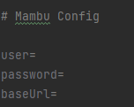

# MambuBack

## Config Mambu



Se deberan configurar las Credenciales para poder usar el ambiente (application.properties).

## Spring Boot - Java


## Swagger

La dependencia **Swagger** permite construir una documentación online en base a estas anotaciones, e incluso provee una interfaz como alternativa para probar manualmente tus controllers:

```bash
http://localhost:8080/swagger-ui/index.html
```


